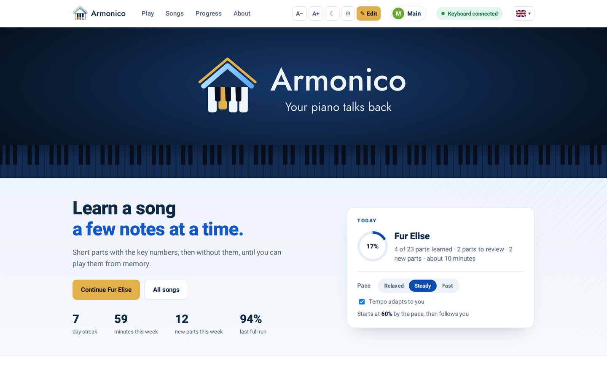
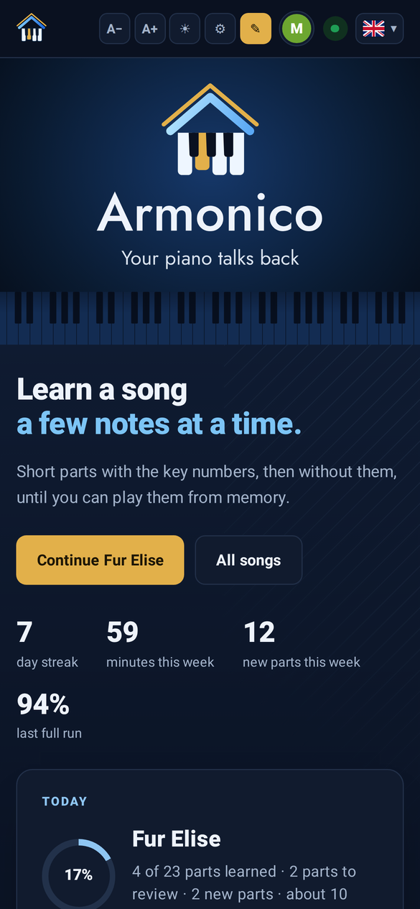

<p align="center">
  <picture>
    <source media="(prefers-color-scheme: dark)" srcset="docs/images/logo-dark.svg">
    
  </picture>
</p>

# Armonico

**Your piano got up first.** It is awake before you every morning, playing until you press the lowest key. Then it spends the day running your home.

Armonico turns a USB MIDI keyboard into part of the smart home, in both directions. Short melodies played on the keys work as shortcuts that run Home Assistant automations. The house plays songs back on the real keyboard: an alarm every morning, a tune when something happens. And the keyboard teaches: a song is learned a few short parts at a time, with key numbers on a screen, then from memory, with the song's own band following the player.

It runs on a small Linux machine next to the keyboard (a Raspberry Pi, a mini PC or a virtual machine) and talks over MQTT.

<p align="center">
  
</p>

<p align="center">
  
</p>

## What it does

**Shortcuts.** A melody of a few notes triggers an automation. New shortcuts are taught by playing them, from Telegram or the terminal.

**Playback and the alarm clock.** Any MIDI file plays on the keyboard, started from Telegram, an automation, the terminal or plain MQTT. The alarm repeats its song until the lowest key is pressed.

**Lessons.** The melody of a song in short parts. The help comes off in three steps, each lesson adds 1 to 3 new parts with no daily cap, every part comes back until it holds, and a full run is scored, with the band when the file has one. [How the method works](docs/learning-method.md).

**The lesson screen.** A live keyboard in any browser on the home network: the next key, the finger, the progress. In English or Hebrew, and playable with the computer's own keys.

**Profiles.** Several people on one keyboard, each with their own progress, recordings, pace and language, and an optional PIN.

**A watchdog.** It notices a keyboard that disconnected or went silent, reports why, and brings it back by itself.

**Telegram and the terminal.** Status, playback, shortcuts, lessons, song downloads and a live log, from a Telegram bot or the `armonico` command on the machine.

**Any keyboard.** 25 to 88 keys. The setup measures it from its two end keys.

## How it works

```
 USB MIDI keyboard
        │  keys, pedal                      ▲  songs, alarm, lesson demos
        ▼                                   │
┌─────────────────────────── Linux machine ──────────────────────────┐
│  bridge      shortcuts · playback · alarm · watchdog               │
│  lessons     lesson engine · lesson screen on port 8099            │
└──────────────────────────────┬─────────────────────────────────────┘
                               │ MQTT  (piano/…)
                               ▼
                      MQTT broker  ◄──►  Home Assistant  ◄──►  Telegram
```

## Quick start

On Debian, Ubuntu or Raspberry Pi OS, with the keyboard plugged in:

```bash
git clone https://github.com/vestacorelabs/armonico.git
cd armonico
sudo ./install.sh
```

With Home Assistant OS or Supervised, the installer can set Home Assistant up as well, from one access token (Home Assistant profile, Security, Long-lived access tokens): the MQTT broker, the sensors, the automations and the blueprints. It asks for the token during the install, and says how to make it. Details in [docs/home-assistant.md](docs/home-assistant.md).

While it installs, the keyboard can play a little classical music, which also shows that the USB connection works both ways. The installer then asks about the MQTT broker: an existing one, such as the Mosquitto broker app in Home Assistant, or a new one on this machine. Home Assistant is optional ([what works without it](docs/installation.md#without-home-assistant)). Last, a one-time setup screen opens in the browser for the broker and the keyboard.

A first test, once it is done (without `sudo` after the next login, see [the armonico command](docs/commands.md#the-armonico-command)):

```bash
sudo armonico play ode_to_joy
```

## Documentation

| Guide | Contents |
|---|---|
| [Installation](docs/installation.md) | Requirements, supported machines, setup, files, updates, removal, troubleshooting |
| [Hardware](docs/hardware.md) | Keyboards, 5-pin MIDI, a Raspberry Pi as a USB MIDI gadget, long cables |
| [Questions and pitfalls](docs/faq.md) | Common questions, and the mistakes that break a setup |
| [Song archives](docs/sources.md) | Where the song search looks, and the license of each archive |
| [Settings](docs/configuration.md) | Every setting and where it lives: the settings file, the lesson screen, the browser, Home Assistant, Telegram, the broker |
| [Terminal commands](docs/commands.md) | The `armonico` command, the installer, full removal, services, MQTT recording, tools |
| [MQTT](docs/mqtt.md) | Setting up a broker, and every topic |
| [Home Assistant](docs/home-assistant.md) | The package, and the alarm, shortcut and reminder blueprints |
| [Telegram](docs/telegram.md) | Creating the bot, and every command |
| [The learning method](docs/learning-method.md) | How lessons work, and why |

## Tests

A lesson only runs with a keyboard plugged in, so the tests cover what the playing rests on rather than the playing itself: cutting a song into parts, reading a run, when a part counts as steady, the key numbers, the hand plan, and whether every line the player reads has a Hebrew version. They touch no files, no network and no hardware, and they finish in well under a second.

```bash
python3 -m unittest discover -s tests
```

## About

Armonico is built and maintained in the Vesta Core Labs home lab, AI among its tools, and has been in daily use there for more than six months, on a real keyboard with a real alarm every morning.

Bugs and questions are welcome in [Issues](../../issues). The most useful report includes the output of `armonico logs` (or `journalctl -u armonico-bridge -n 100`) and what the keyboard was doing at the time.

## Security

Security problems go to the private channel described in [SECURITY.md](SECURITY.md), not to a public issue. That file also says what the project does and does not defend, which is worth reading before putting it on a network that is not only yours.

## License

[MIT](LICENSE). The software is provided as is, without warranty of any kind.

It ships with work by other people, under their own licenses, and those licenses travel with any copy of this repository. [NOTICE](NOTICE) lists all of it: the Salamander Grand Piano recordings by Alexander Holm under CC BY 3.0, the Heebo font under the SIL Open Font License, and the public domain editions from the [Mutopia Project](https://www.mutopiaproject.org/) the installer's music is cut from, listed piece by piece in [setup/music/SOURCES.md](setup/music/SOURCES.md).

Songs downloaded by the song search are not part of this repository. Each one's license is recorded next to the file when it is saved, and some carry a share-alike condition. [docs/sources.md](docs/sources.md) says which archives are reached and why.
